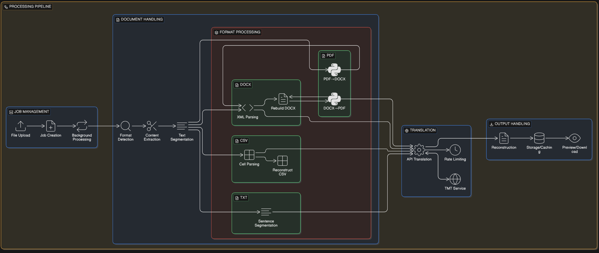
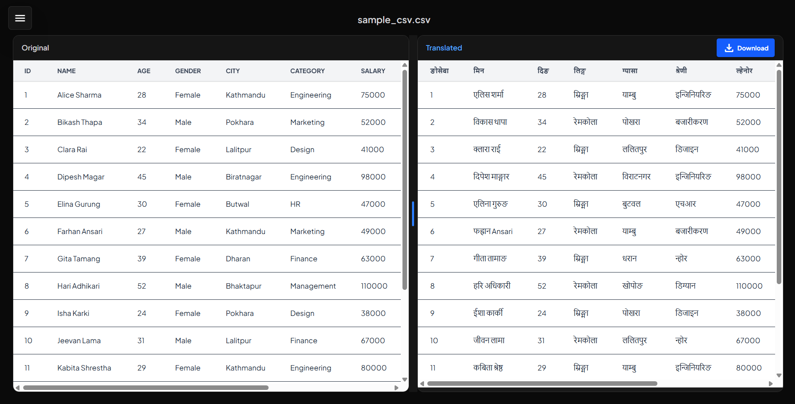
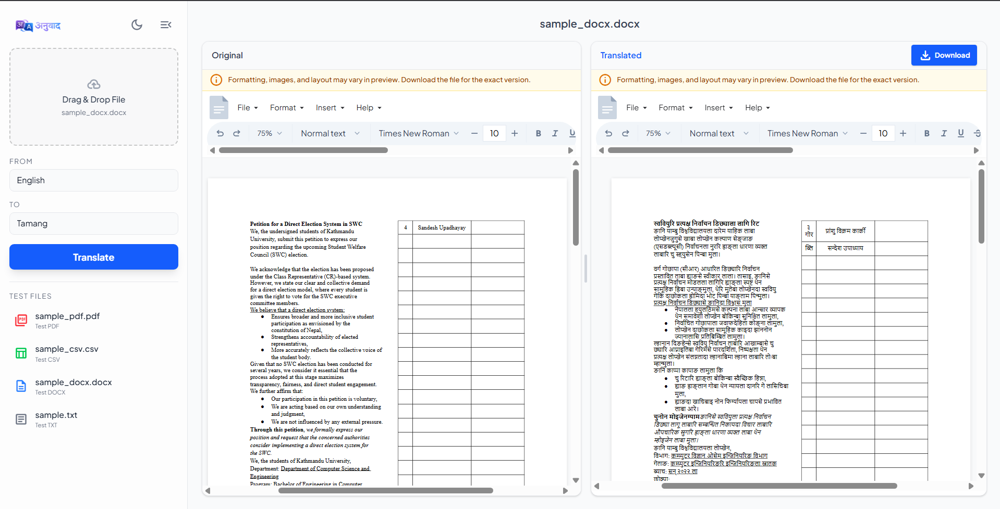
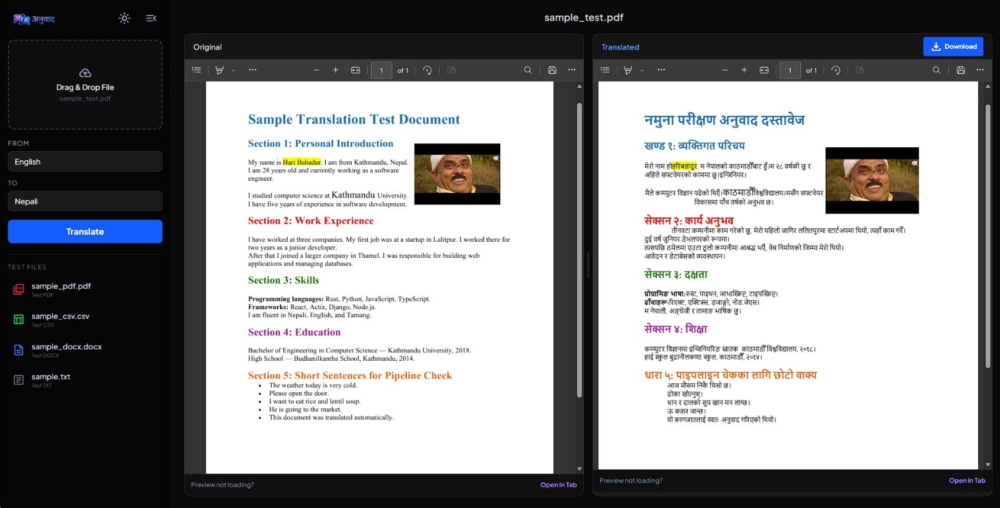
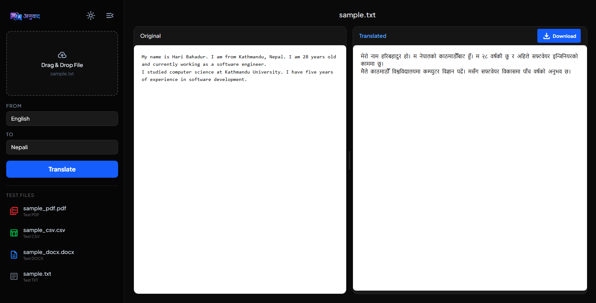

# Aanubadh

**Live Demo:** [aanubadh-orxv.onrender.com](https://aanubadh-orxv.onrender.com/)

translation tool built for KU Information and Language Processing Research Lab, tmt project. supports english, nepali and tamang across pdf, docx and csv.

the project is still in active development. found a significant gap in layout-preserving pdf extraction; planning to push this further for the open source community and low-resource language research.

---

## api

url: http://127.0.0.1:1997/translate  
method: POST  
content-type: multipart/form-data  
params: file (pdf/docx/csv), src (en/ne/tam), tgt (en/ne/tam)

```bash
curl -X POST http://127.0.0.1:1997/translate \
  -F "file=@document.pdf" \
  -F "src=en" \
  -F "tgt=ne" \
  --output "translated_document.pdf"
```

the response streams the translated file directly back. no job ids, no polling, just the file.

---

## what we tried and where it failed

we started by grabbing mut refs to runnable elements inside paragraphs and translating one to one. worked for simple docs but hit a wall with images inside tables, turns out docx-rs just hasnt implemented that yet.

after that we used quick-xml for direct parsing, grabbing only w:t nodes, storing in a vec and reconstructing with the same elements. quick and easy.

we also tried mapping a special token `Aldrep` to batch sentences. the api stripped any unicode/symbols, and even when tokens got through it broke sentence context and added commas at every full stop. abandoned.

wasm was considered briefly, not viable because we make outbound api calls. switched back to plain tcp.

pdf2htmlEX converts pdf to high quality html which we can open as pdf in browser. worked, but eventually ditched it, because it used css positional styling to map the layout, which was way harder to parse. even after parsing we had to go word by word making it unreliable.

---

## how it works

no ocr involved. works directly on document structure so the source pdf needs to be text-based, not a scanned image.

the server is axum on port 1997. one route: POST /translate. reads the multipart fields, detects the file extension, routes to the right handler, and streams the result back as an attachment.

for docx, the file is a zip of xml files. we unzip it in memory, find word/document.xml and any headers or footers, walk through every w:t node, decode the xml entities, translate the text, re-encode, and repack the zip. fonts get slightly reduced (multiplied by 0.82) for nepali and tamang targets because translated text tends to be longer and overflow.

for pdf, there is no way to edit a pdf directly so it goes through a three step pipeline. pdf2docx converts the pdf to a docx preserving the layout. the docx goes through the same xml engine as above but sentence by sentence instead of parallel (from_pdf flag). then docx2pdf renders it back. both python steps run as subprocesses.

for csv, we read every cell, skip anything that has no alphabetic characters, skip urls and emails, and translate the rest. headers are not treated specially since has_headers is set to false — every row goes through the same check.

translation calls go to the tmt api with a bearer token from API_TOKEN in the env. there is a global semaphore allowing 50 concurrent requests and a 1.5s delay between them. on a 429 it backs off exponentially and retries up to 10 times, then falls back to the original text. sentences are split with unicode-segmentation before translation so mr. dr. prof. and similar abbreviations don't get broken into separate calls. punctuation is fixed after translation — periods become । for nepali and tamang targets, and ? or ! get appended if the original had them.

---

## api challenges

while the underlying translation api is powerful, we encountered several quirks that required manual handling or still persist in the output:

- **hallucinatory repetition**: occasionally, simple phrases trigger an infinite loop in the model. for example, "yellow to ensure background colors survive" has returned "पहेँलो" (yellow) repeated dozens of times until the output buffer was exhausted.
- **word duplication**: short strings or comma-separated lists often result in double translations (e.g., "hello", "name", "yes" returning "हेलो हेलो", "नाम नाम", "हो हो" respectively).
- **forced classifiers on numbers**: numbers are often converted with context-specific classifiers that may not fit the layout. translating "1" yields "१ वटा" (one piece) and "100" yields "१०० जना" (100 people) respectively, which disrupts numerical data alignment.
- **csv structural integrity**: comma-separated values are handled inconsistently. some results preserve commas while others strip them, making it difficult to maintain strict csv column structures without extensive post-processing.
- **aggressive rate limiting**: the api hits rate limits very quickly. we mitigated this by implementing a global semaphore (50 concurrent requests), a 1.5s delay between batches, and an exponential backoff strategy with up to 10 retries.





### Translation Demos

**Homepage**


**CSV Translation**


**DOCX Translation**


**PDF Translation**


**Text Translation**



---

## setup

### Backend Setup
needs rust, python, with pip, and an API_TOKEN from [ilprl ku](https://tmt.ilprl.ku.edu.np)

```bash
git clone github.com/BipulLamsal/Aanubadh 
cd Aanubadh
echo "API_TOKEN=your_token_here" > .env
pip install pdf2docx docx2pdf
cargo build --release
cargo run --release
```

### Frontend Setup
The project includes a React+Vite frontend for a better user experience. To run it:

```bash
cd frontend
npm install
npm run dev
```

open http://localhost:5173
